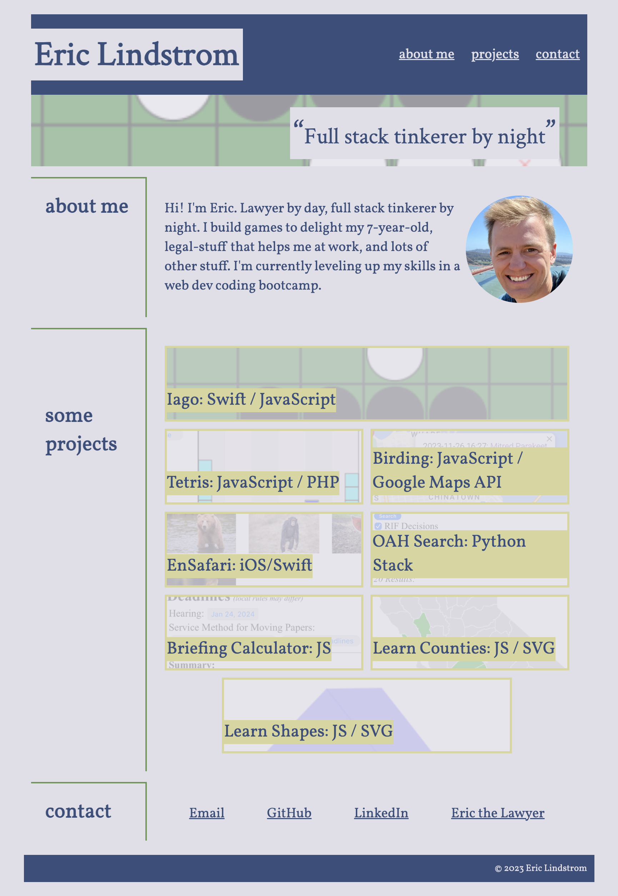
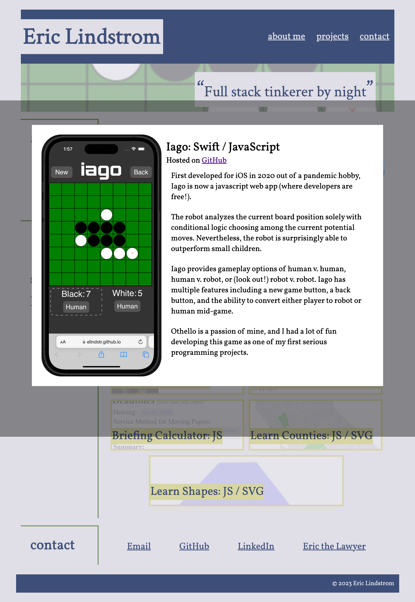

# bc-mod2-challenge: Eric's Portfolio

## Description
This is a portfolio website showing off some of my projects.

I enjoyed practicing a bunch of css tricks making this: responsive design; flex boxes; semi-transparent background images with hover transitions; css variables; google fonts; smooth scroll behavior; modal windows. 

I used the Xcode simulator to capture screenshots of an iPhone 15 running the deployed apps.

## Screenshots

<table>
  <tr>
    <td style="vertical-align: top" width="30%">
      <br>
      <i>screenshot of portfolio (2023-12-12)</i>
    </td>
    <td style="vertical-align: top" width="30%">
      <br>
      <i>screenshot of portfolio displaying a featured project (2023-12-12)</i>
    </td>
  </tr>
</table>

## Acceptance Criteria

Here are the critical requirements necessary to develop a portfolio that satisfies a typical hiring manager’s needs:

```
GIVEN I need to sample a potential employee's previous work
WHEN I load their portfolio
THEN I am presented with the developer's name, a recent photo or avatar, and links to sections about them, their work, and how to contact them
WHEN I click one of the links in the navigation
THEN the UI scrolls to the corresponding section
WHEN I click on the link to the section about their work
THEN the UI scrolls to a section with titled images of the developer's applications
WHEN I am presented with the developer's first application
THEN that application's image should be larger in size than the others
WHEN I click on the images of the applications
THEN I am taken to that deployed application
WHEN I resize the page or view the site on various screens and devices
THEN I am presented with a responsive layout that adapts to my viewport
```

## Acceptance Criteria Tests
#### Technical Acceptance Criteria: 40%
* Satisfies all of the above acceptance criteria.✅
#### Deployment: 32%
* Application deployed at live URL.✅
* Application loads with no errors.✅
* Application GitHub URL submitted.✅
* GitHub repository contains application code.✅
#### Application Quality: 15%
* Application resembles the mock-up functionality provided in the Challenge instructions.✅
#### Repository Quality: 13%
* Repository has a unique name.✅
* Repository follows best practices for file structure and naming conventions.✅
* Repository follows best practices for class/id naming conventions, indentation, quality comments, etc.✅
* Repository contains multiple descriptive commit messages.✅
* Repository contains quality readme with description, screenshot, link to deployed application.✅
